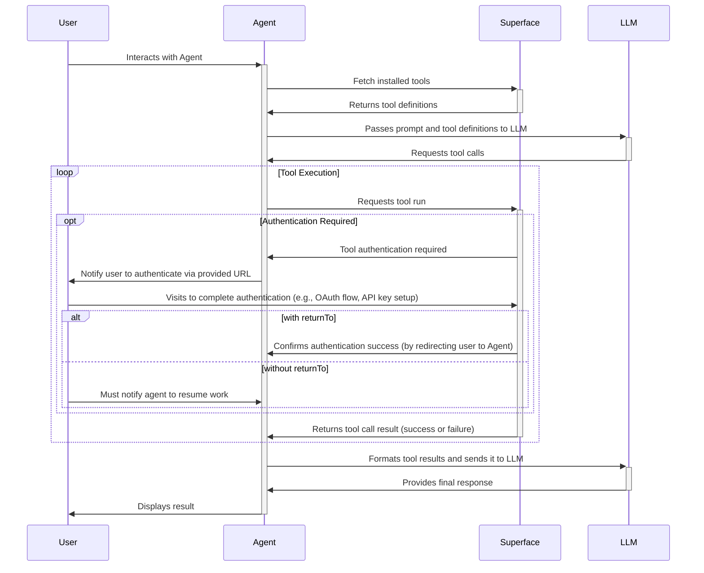

[Website](https://superface.ai) | [Documentation](https://docs.superface.ai) | [Twitter](https://twitter.com/superfaceai) | [Support](mailto:support@superface.ai)

# Superface SDK

Superface SDK to integrate intelligent tools to your Agent.

## Supported languages and frameworks

* [🦄 JavaScript/TypeScript](./typescript/)
  * [Client](./typescript/src/client/) Low level client to interact with Superface toolkit
  * [OpenAI](./typescript/src/openai/) Wrapper on Superface Client for streamlined use with [OpenAI TypeScript and JavaScript API Library](https://github.com/openai/openai-node)
* [🐍 Python](./python/)

## How it works

