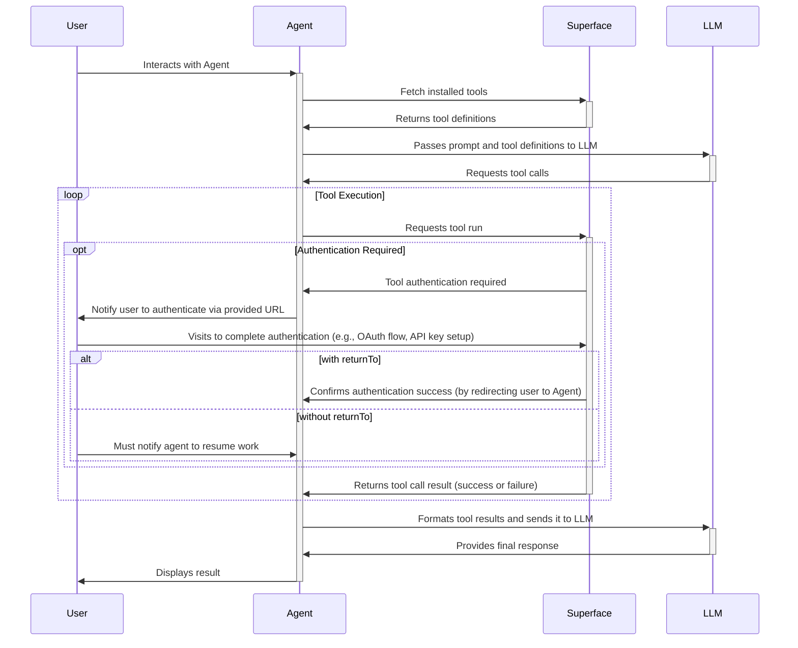

```mermaid
sequenceDiagram
    participant u as User
    participant a as Agent
    participant sf as Superface
    participant l as LLM
    u ->>+ a: Interacts with Agent
    a ->>+ sf: Fetch installed tools
    sf ->>- a: Returns tool definitions
    a ->>+ l: Passes prompt and tool definitions to LLM
    l ->>- a: Requests tool calls
    loop Tool Execution
        a ->>+ sf: Requests tool run
        opt Authentication Required
            sf ->> a: Tool authentication required
            a ->> u: Notify user to authenticate via provided URL
            u ->> sf: Visits to complete authentication (e.g., OAuth flow, API key setup)
            alt with returnTo
                sf ->> a: Confirms authentication success (by redirecting user to Agent)
            else without returnTo
                u ->> a: Must notify agent to resume work
            end
        end
        sf ->>- a: Returns tool call result (success or failure)
    end
    a ->>+ l: Formats tool results and sends it to LLM
    l ->>- a: Provides final response
    a ->>- u: Displays result
```